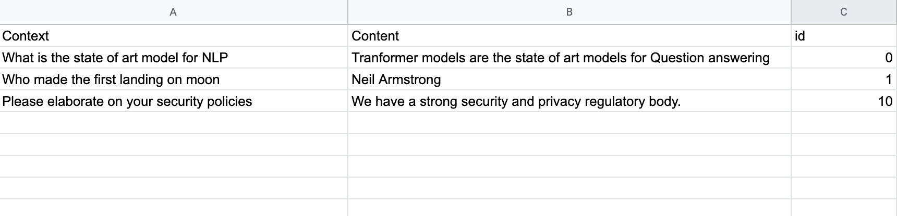

This Pipeline consists of two parts - Creating the embedding files and scoring the documents. To run this pipeline run the the `pipeline_bash.sh' file along with 
the following arguments:

1. Storage - path to store the embeddings and index (this can be any path location that you want to save the embeddings at)
2. Organization name - name of the organization if there is one or specify a particular folder name for the same to store at within the storage path
3. Embedding type - We use two different embeddings  - USE Lite (Universal Sentence Encoder Lite Version) which is used in production and BERT 
4. Input File - Input file containing the Q&A pairs. This requires  a csv file with  a format as shown below

5. Output file - Location of the output file as a full path

You will need to additionally install the sentence_transformers package as:

pip install sentence_transformers

To run the pipeline - run the script file as :

bash pipeline_bash.sh < insert storage path > <organization_name> <embedding_type (use-lite/bert)> <insert input filename as a path > <output csv file as path>

